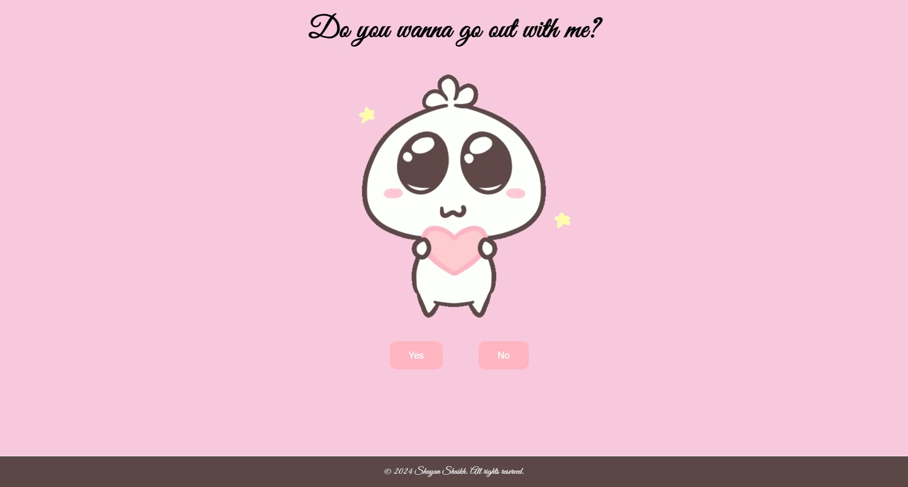

# Do You Wanna Go Out With Me?

This is a simple website where you can ask someone if they want to go out with you. It features two buttons, "Yes" and "No". Additionally, the "No" button moves to a random position on the screen when hovered over.

## How to Use

1. Clone or download this repository to your local machine.
2. Open the `index.html` file in a web browser.
3. Click the "Yes" or "No" button to indicate your response.
4. Hover over the "No" button to see it move to a random position on the screen.

## Technologies Used

- HTML
- CSS
- JavaScript

## Credits

This project was created by shayanshaikh996@gmail.com

## License

This project is licensed under the MIT License - see the [LICENSE](LICENSE) file for details.
